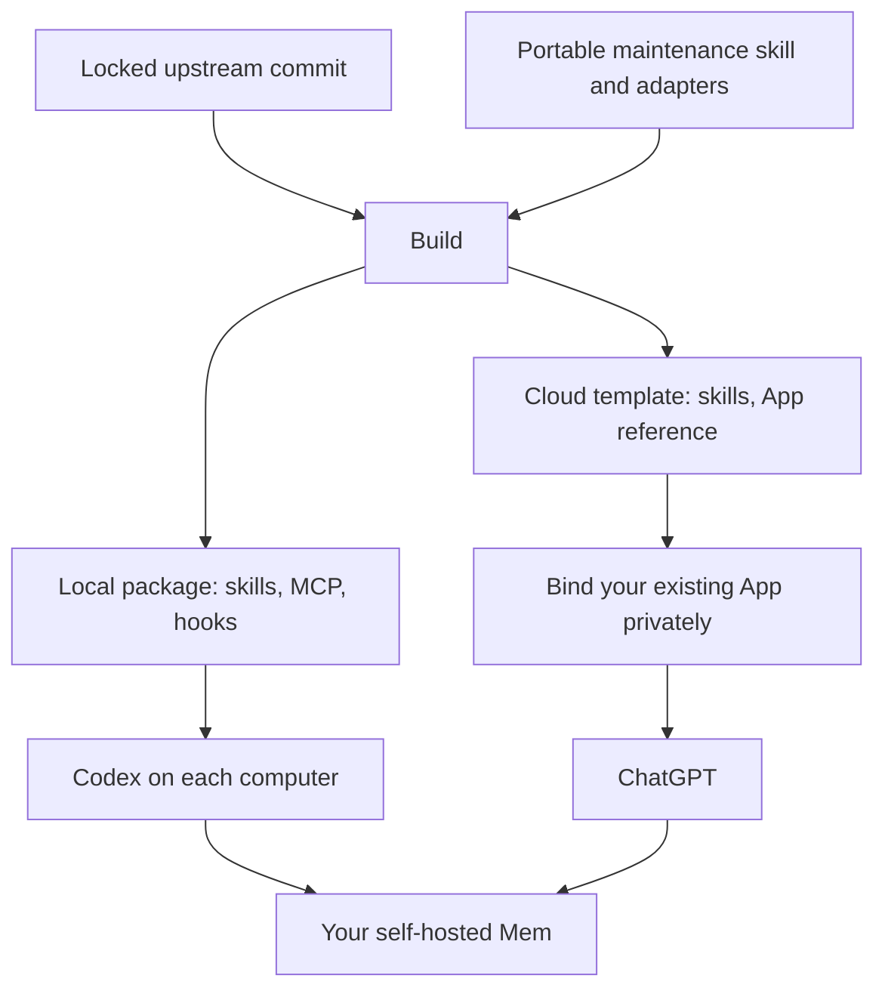
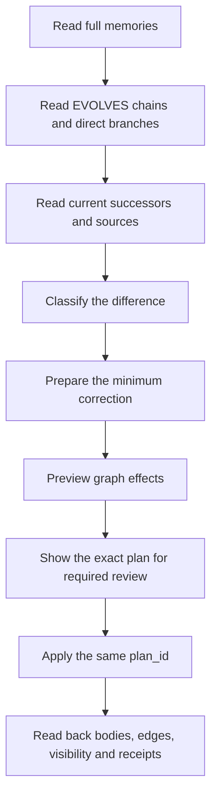
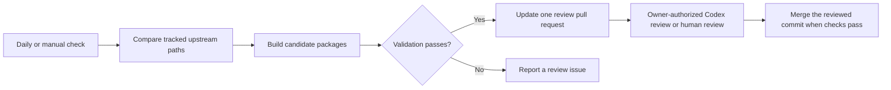

# Nowledge Mem Personal

[](https://github.com/Lutra-Fs/nowledge-mem-personal/actions/workflows/ci.yml)
[](https://github.com/Lutra-Fs/nowledge-mem-personal/actions/workflows/upstream-monitor.yml)

Use one source revision to build a local plugin and a cloud template for self-hosted Nowledge Mem.
The cloud template needs your existing registered App. Local hooks run on each computer.

This repository contains reusable instructions and source code. It does not contain personal memories, server credentials, or a live App binding.



## Build

Python 3.10 or later and Git are required. The build programs use the Python standard library.

```bash
git clone https://github.com/Lutra-Fs/nowledge-mem-personal.git
cd nowledge-mem-personal
python3 scripts/build.py --output-dir dist
python3 scripts/validate.py dist --allow-template
python3 -m unittest discover -s tests
```

The first build fetches the exact upstream commit into ignored `.cache/` storage.
`upstream.lock.json` selects the source. `personal.json` selects the personal names and version.
The public `packages/` directories are generated from the same source revision.

## Bind the cloud template

Use the App ID from your existing ChatGPT connection. Do not use the official Nowledge Cloud binding for a self-hosted workspace.

```bash
python3 scripts/build.py --app-id asdk_app_YOUR_REGISTERED_APP_ID --output-dir .private/dist
python3 scripts/validate.py .private/dist
```

`.private/` is ignored by Git. Keep bound packages outside public releases and public CI artifacts.
The public cloud package is an unbound template. It is not an account-ready installation.

Open your private workflow plugin in ChatGPT. If its menu offers **Upload new version**,
download the current ZIP as a backup, preserve its plugin identity and App reference,
and upload the updated private package. Use a deployment version newer than the installed wrapper.
Prepare that update from the downloaded ZIP:

```bash
python3 scripts/prepare_cloud_update.py --original-zip .private/original-plugin.zip
```

The helper builds the current adapter, preserves the original plugin identity and App mapping,
and writes a ZIP inside `.private/cloud-update/`. Its deployment version advances separately
from the adapter version recorded in source provenance.
Otherwise, use **Edit Plugin** or **Plugin Creator** with the existing App, if available.
Add the cloud skills and their reference files through the supported workflow.
Account permissions determine which creation and editing routes are available.
See the [OpenAI creation guide](https://learn.chatgpt.com/docs/build-plugins).

Test the owner, agent, Space, and exact-ID memory reads in each target client.
Test Chat and Work separately. Check mobile availability before relying on it.
MCP does not automatically capture full ChatGPT transcripts.

## Install the local package

The public marketplace exposes the local package only.

```bash
codex plugin marketplace add Lutra-Fs/nowledge-mem-personal --ref main
codex plugin add nowledge-mem-personal-local@nowledge-personal
```

Configure the remote Mem connection outside the package with the current `nmem config mcp` guidance.
The MCP server key remains `nowledge-mem`.
Verify the Context Bundle through the new plugin before enabling hooks.
Enable one local Nowledge hook set. Review and trust its definitions.
Each computer needs its own local installation, connection configuration, and supported runtime.
The cloud template does not deploy local scripts.

## Review memory evolution

The maintenance skill inspects history before changing a claim.



Preserve historical bodies when a valid replacement exists.
Treat independent facts as independent. Use a Memory Link when that relationship is useful.
If a plan becomes stale, read fresh evidence and show a new plan.
Do not archive a memory only because it has a replacement.

## Monitor upstream

GitHub Actions checks upstream each day. Manual runs are also available.
The monitor compares only the paths recorded in the lock file.
Unrelated upstream changes do not produce update requests.

For compatible changes, the monitor updates one review branch and pull request.
The request contains the new lock and regenerated public packages.
Candidate packages must pass build and validation checks before that request is published.
Incompatible changes produce a review issue.
The monitor does not merge, install a plugin, or change Mem data.



Inspect changes locally without publishing:

```bash
python3 scripts/monitor_upstream.py --dry-run
```

Only the monitor job receives repository write permissions. It uses the repository `GITHUB_TOKEN`.
Build jobs need no Mem token, live App ID, or server access.
GitHub may require approval for CI runs on a bot-created pull request. The monitor also validates the candidate directly.
An owner can authorize a separate Codex heartbeat to review and merge eligible update requests.
That reviewer reads the actual upstream diff and checks validation for the current PR head.
It merges with a SHA guard only when no unresolved findings remain.
The heartbeat uses the local Codex host; keep that host available for scheduled reviews.
Future review runs do not change installed plugins, account connections, hooks, or Mem data.
Public scheduled workflows stop after 60 days without repository activity. Re-enable the workflow if that occurs.
See [GitHub schedule behavior](https://docs.github.com/en/actions/reference/workflows-and-actions/events-that-trigger-workflows#schedule).

## Update and recover

Review the upstream request before merging, or use an owner-authorized Codex reviewer.
Check changed tool contracts and personal adapters.
After a merge, use the same personal source to make private bound cloud packages.
Update installed ChatGPT instructions through the editor or Creator. GitHub changes do not update personal ChatGPT plugins automatically.

Keep the previous private package before an update.
If the local package fails, disable its hooks before enabling the previous hook set.
A package rollback does not require changing Mem data.

The local skill at `~/.agents/skills/nmem-maintenance` remains your existing private maintenance source.
This repository contains a generic distributable version. It excludes private incident history and personal conventions.

## Attribution

See [NOTICE.md](NOTICE.md) for upstream attribution and [LICENSE](LICENSE) for the original code license.
This project is an independent personal extension.
